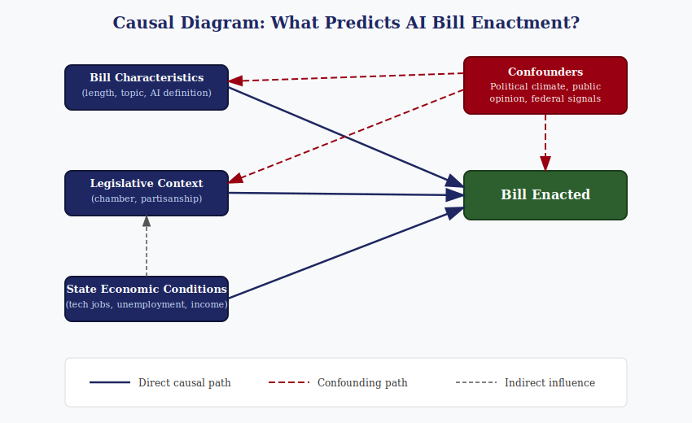

## Prediction vs. Explanation

There's a real tension between knowing *why* something happens and just knowing *that* it will happen. Google Flu Trends is a good example of how that plays out. Google built a model that tracked flu-related search queries to predict outbreaks faster than the CDC could through traditional reporting. For a while, it worked really well. But the model had no understanding of *why* people were searching those terms. When media coverage of flu season spiked or search behavior shifted for unrelated reasons, the model started massively overestimating flu cases. It predicted well until it didn't, and because nobody could explain what was actually driving the predictions, nobody could fix it when it broke.

That's the core problem with prediction without explanation. If you don't understand the mechanism behind your results, you have no way to tell when the model is right for the wrong reasons. And when conditions change — which they always do — a model built purely on correlation will fail in ways you can't anticipate.

So the short answer is: prediction matters when you need to act fast, explanation matters when you need to act right. And as Google Flu showed us, prediction without explanation eventually falls apart.

## Causal Diagram: What Predicts AI Bill Enactment?

For my research on AI bill enactment, here's how I think about the causal relationships:

There are three main paths I'm looking at that could directly influence whether a bill gets enacted:

**Bill Characteristics** like the length of the bill, the topic it covers, and whether it includes a formal definition of AI. A bill focused on transparency requirements might have a better shot at passing than one trying to ban an entire category of AI use.

**Legislative Context** including which chamber introduced it and the partisanship of the author. A bill introduced by a majority-party member in a favorable committee has structural advantages that have nothing to do with the bill's content.

**State Economic Conditions** such as tech employment levels, unemployment rate, and per capita income. States with bigger tech sectors might approach AI legislation differently than states where AI isn't really part of the local economy.

## Where the Confounders Come In

The tricky part is that none of these paths operate in isolation. Political climate, public opinion about AI, and signals from the federal government all act as confounders — they influence both the predictors and the outcome at the same time.

For example, a wave of negative news coverage about AI (say, deepfakes during an election cycle) could simultaneously push legislators to introduce stricter bills *and* create the political will to pass them. That creates an association between bill topic and enactment that looks causal but is really being driven by the public mood. The bill didn't pass because of its topic — it passed because the political environment made that topic urgent.

Similarly, state economic conditions don't just affect enactment directly. They also shape the legislative context — wealthier states with more tech workers tend to have legislators who are more familiar with AI issues, which changes the kinds of bills that get introduced in the first place.

## Causal Claim vs. Predictive Association

In my project, I can build a logistic regression model that identifies which variables are associated with enactment. If I find that bills with formal AI definitions are more likely to pass, that's a predictive association — it tells me that definition inclusion and enactment tend to go together. But I can't call it causal unless I can rule out the confounders. Maybe states that include definitions are also the ones with more tech-savvy legislators or stronger public demand for AI regulation, and those are the real drivers.

To make a genuine causal claim, I'd need something like a natural experiment or an instrumental variable that isolates the effect of one predictor while holding the confounders constant. With observational data like mine, the honest move is to say "these factors predict enactment" rather than "these factors cause enactment." The diagram helps me stay clear on that distinction.
